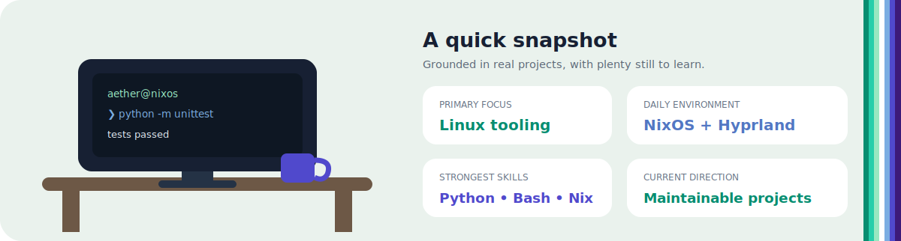

<a href="https://github.com/Aetherelic"></a>


<div align="center">
  <a href="https://github.com/Aetherelic"></a>
  <a href="https://github.com/Aetherelic/arcane-guard"></a>
  <a href="https://github.com/Aetherelic/commitquest"></a>
  <a href="https://github.com/Aetherelic/Riceprint"></a>
</div>

<h2>🏳️‍🌈 A little more about me...</h2>



<div>
  <p>Hey, I’m <b>Aether</b>, a Linux enthusiast and aspiring open-source developer from the United Kingdom.</p>
  <p>I build <b>Linux tools, command-line applications, NixOS configurations and custom Wayland interfaces</b>, with an emphasis on practical software, clear documentation and thoughtful visual design.</p>
  <p>My strongest current areas are <b>Python, Bash, Nix and QML</b>. I am also developing my TypeScript, JavaScript and CSS skills through real projects rather than isolated exercises.</p>
  <p>Outside development, I enjoy Linux ricing, gaming, music and designing interfaces that feel coherent rather than assembled from unrelated parts.</p>
</div>

```typescript
const aether = {
    location: "United Kingdom",
    identity: "gay",
    os: ["NixOS", "Arch Linux", "Windows"],
    languages: {
        comfortable: ["Python", "Bash", "Nix", "QML"],
        developing: ["TypeScript", "JavaScript", "CSS"],
        formats: ["JSON", "Markdown"],
    },
    engineering: {
        linux: ["NixOS", "Hyprland", "Wayland", "systemd"],
        desktop: ["Quickshell", "Qt", "Rofi", "adaptive theming"],
        tooling: ["Git", "GitHub Actions", "unit tests", "CLI design"],
        hardware: ["NVIDIA", "PipeWire", "Bluetooth", "multi-monitor"],
    },
    interests: ["Linux distributions", "desktop design", "gaming", "music"],
    currentFocus: "building useful, maintainable open-source projects",
};
```

<h2>🧰 Featured projects (interactive)</h2>

<table align="center">
  <tr>
    <td align="center">
      <a href="https://github.com/Aetherelic/arcane-guard">
        
      </a>
    </td>
    <td align="center">
      <a href="https://github.com/Aetherelic/commitquest">
        
      </a>
    </td>
  </tr>
  <tr>
    <td align="center">
      <a href="https://github.com/Aetherelic/Riceprint">
        
      </a>
    </td>
    <td align="center">
      <a href="https://github.com/Aetherelic/configuration.nix-">
        
      </a>
    </td>
  </tr>
</table>

> [!NOTE]
> This portfolio is a living snapshot. Projects, tools and focus areas will change as I continue learning and building.

<h2>🐧 Linux experience</h2>

| Area | Practical experience |
|---|---|
| **Systems** | NixOS, Arch Linux, flakes, package management, systemd and modular configuration |
| **Desktop engineering** | Hyprland, Wayland, Quickshell, QML, Qt, Rofi and wallpaper-driven theming |
| **Automation** | Python CLIs, Bash scripts, maintenance tools and configuration workflows |
| **Hardware** | NVIDIA graphics, PipeWire audio, Bluetooth and multi-monitor layouts |
| **Gaming** | Steam, Proton, GameMode, MangoHud and compatibility troubleshooting |
| **Project quality** | Git, tests, GitHub Actions, release notes and user-facing documentation |

<h2>📚 More work</h2>

<div align="center">

[](https://github.com/Aetherelic/Wallpaper-Megathread)
[](https://github.com/Aetherelic/adaptive-hyprland-rice)
[](https://github.com/Aetherelic/Gruvbox-Dark-Fastfetch)

</div>

---


