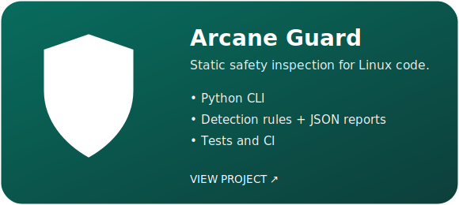
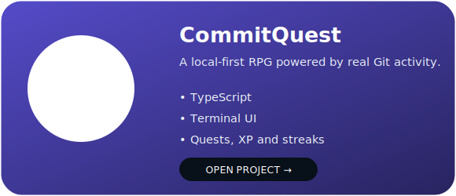
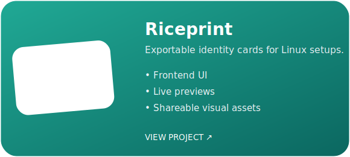
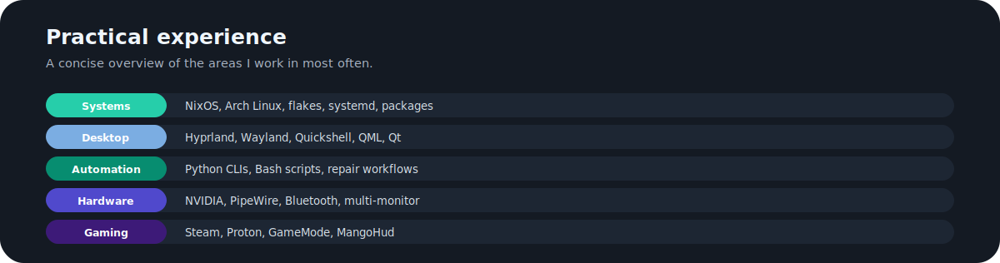

 

###

  
  
  
  

Hey, I’m **Aether**, a Linux enthusiast and aspiring open-source developer from the United Kingdom!

I build **Linux tools, command-line applications, The occasional rice and things I am interested in**, with an emphasis on aesthetics.

My strongest current areas are **Python, JSON, Nix, CSS and QML**. I am also developing my TypeScript and JavaScript skills through real projects rather than isolated exercises.

 

<table align="center">
  <tr>
    <td align="center">
      
    </td>
    <td align="center">
      
    </td>
  </tr>
  <tr>
    <td align="center">
      
    </td>
    <td align="center">
      
    </td>
  </tr>
</table>

 

 

 

###

  

